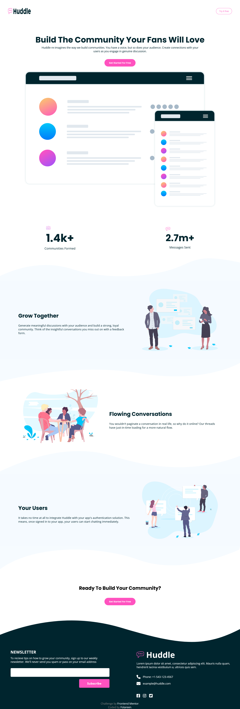

# Frontend Mentor - Huddle landing page with curved sections solution

This is a solution to the [Huddle landing page with curved sections challenge on Frontend Mentor](https://www.frontendmentor.io/challenges/huddle-landing-page-with-curved-sections-5ca5ecd01e82137ec91a50f2). Frontend Mentor challenges help you improve your coding skills by building realistic projects. 

## Table of contents

- [Overview](#overview)
  - [The challenge](#the-challenge)
  - [Screenshot](#screenshot)
  - [Links](#links)
  - [Built with](#built-with)
  - [What I learned](#what-i-learned)
- [Author](#author)

## Overview

### The challenge

Users should be able to:

- View the optimal layout for the site depending on their device's screen size
- See hover states for all interactive elements on the page

### Screenshot

### Links

- Solution URL: [frontend mentor solution](https://www.frontendmentor.io/challenges/huddle-landing-page-with-curved-sections-5ca5ecd01e82137ec91a50f2/hub/responsive-landing-page-using-css-flexbox-and-media-queries-Sy_CpWmV9)

#### live site url
- Live Site URL: [https://huddle-landing-page12.netlify.app/](https://huddle-landing-page12.netlify.app/)

### Built with

- Semantic HTML5 markup
- Flexbox
- Mobile-first workflow

### What I learned

I learned how to make curved section backgrounds using svgs

## Author
- Frontend Mentor - [@folareen](https://www.frontendmentor.io/profile/folareen)
- Twitter - [@__folareen__](https://www.twitter.com/_folareen_)